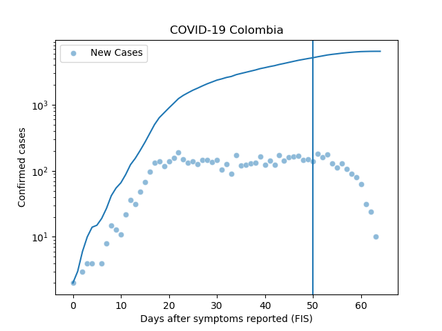

#Covid-19 Colombia Datavis
## A section dedicated to COVID-19 data for Colombia

This section focuses in the visualisation of COVID-19 cases in Colombia. It uses the oficial data set provided by the goverment of Colombia through [coronaviruscolombia.gov.co](https://coronaviruscolombia.gov.co/) 

The aim of developing this tools is to provide an open resource for people wiling to understand the behaviour of Covid-19 cases in Colombia. Users with basic knowledge of the python programing language can replicate all the tools developed. 

Data Access: The [script](getData.py) sets the functions to get the CSV file from the oficial website. [Under development] However, the current state uses a file manually dow.loaded from the web site.

General trends: The [script](line_plots.py) uses the [Seaborn Library](https://seaborn.pydata.org/) to plot the general trends for Colombia's total cases by source and treatment.

Death rate: The script aims to visualise the evolution of Covid-19 death trends in Colombia. 

Maps: The [script](contagion_maps.py) uses [the Geopandas library](https://geopandas.org/) and official geospatial data from Colombia to map the spatial distribution of the cases.

# Data Structures

Note: To benefit international researchers and developers as well as to make this repository "discoverable" in the web, all documentation and source code will use English as the main language.

## Covid-19 Official Data for Colombia 

The government of Colombia distributes the official data set of Covid-19 Cases as a csv file using an [Infogram Widget](https://coronaviruscolombia.gov.co).
From that structure, the data access script sets a data structure based on the original structure according to the following list.

| *Original Name* | *Field name* |
| --- | --- |
| 'ID de caso' | 'id_case' |
| 'Fecha de diagnóstico' | 'date' |
| 'Ciudad de ubicación' | 'city' |
| 'Departamento' | 'region' |
| 'Atención' | 'treatment' |
| 'Edad' | 'age' |
| 'Sexo' | 'sex' |
| 'Tipo*' | 'Origin' |
| 'Pais de Procedencia' | 'Origin_country' |

## Data sources:

Geospatial data from Colombia come form open data platforms from the government of Colombia:
### [SIGOT](https://sigot.igac.gov.co/)
- Municipalities, in Spanish "Municipios" 
- Provinces or regions, in Spanish "Departamento"
### [Open Data portal](datos.gov.co)
- Airports

