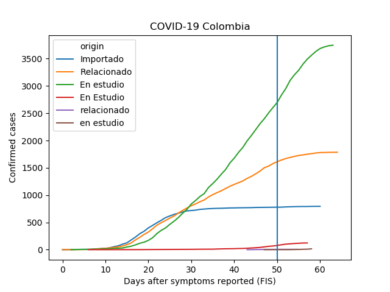
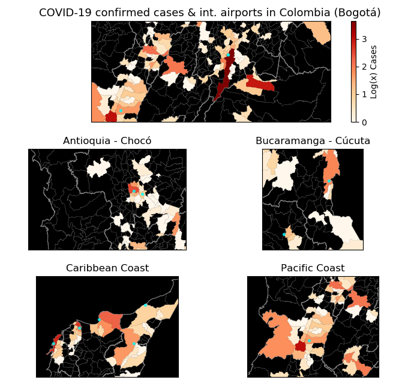

#Covid-19 Datavis
## A personal project to visualise data about COVID-19

This repository is an academic exercise aiming to explore data visualisation under the circumstances of the COVID-19 pandemic crisis.

Through multiple Python functions (e.g., Pandas, Seaborn, Geopandas, among others), I turned official data about COVID-19 delivered by the [WHO](https://www.who.int/health-topics/coronavirus), [Johns Hopkins University](https://github.com/CSSEGISandData) and [Colombia's INS](https://coronaviruscolombia.gov.co) into simple and informative plots and maps.

## World

This section offers tools to explore the trends of COVID-19 confirmed cases and death rates across different coutries.

For this particular section, I have developed a Notebook (i.e., Google Colab version) for the basic plotting task. Find it [here](world/Ex_1_Covid19_country_trends.ipynb) and check this easy-to-use format.

##Colombia

This section offers specific tools for accessing COVID-19 data from Colombia and visualising specific trends based on customised functions for confirmed cases, death rates and treatments.

Also, I have explored customised maps for Colombia taking advantage of open geospatial data sets available and my personal knowledge of the country. There were interesting clustering patterns found in these maps.

 

## Notes

This personal project started just as a way to spend some time during this crisis. However, the constant updates on data sets and my personal interest in data visualisation kept it alive.

Feel free to contact me, post issues, fork this repository or simply tweet me at [@diegopajarito](https://twitter.com/diegopajarito)